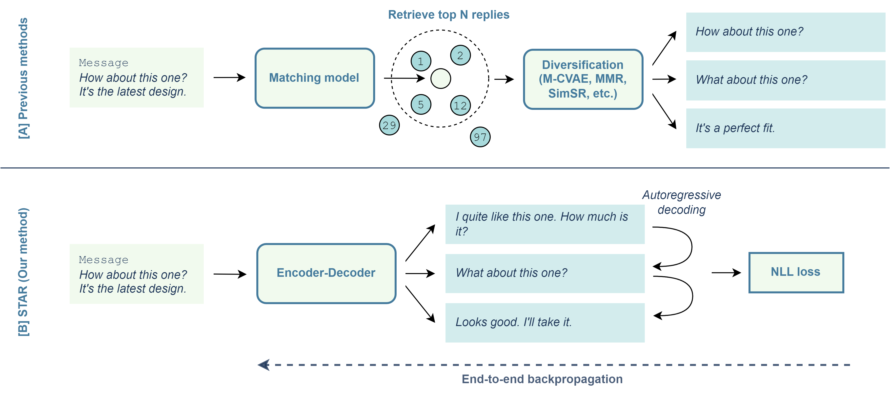

# End-to-End Autoregressive Retrieval for Smart Reply Systems via Bootstrapping

This is the official code for the EMNLP 2023 submission "End-to-End Autoregressive Retrieval for Smart Reply Systems via
Bootstrapping".



## Repo Overview
* The various scripts are all contained in the root folder. `constants.py` provides a convenient place to store locations of important files if you want to manually change the defaults in the scripts.
* The different modules that provide the core functionality are contained in the `src/` folder. `src/agents/` contains the different methods used during inference. `src/corpora/` contains the code to process the datasets. `src/modeling/` contains the models for training. `src/simulation/` contains the engine for running inference.
* `assets/` contains the relevant images. 

# Setup
The code is designed to run on three datasets: Reddit, PersonaChat and DailyDialog. 
* The original Reddit dataset can be downloaded from [here](https://github.com/zhangmozhi/mrs). We provide the reduced version used in this paper in the `reddit/` folder.  
* For PersonaChat, the data can be downloaded from [here](https://drive.google.com/open?id=1gNyVL5pSMO6DnTIlA9ORNIrd2zm8f3QH).
* For DailyDialog, we use a pre-existing dataset from HuggingFace which is automatically downloaded when relevant scripts are run. If you are looking to use additional datasets, we recommend imitating how we process the dataset in `dailydialog.py`.

## Dependencies
This work was designed for Python 3.8.12. To install relevant dependencies run
```
pip install -r requirements.txt
```

# Running the Experiments
In this section I summarise the series of scripts that should be run to obtain the final STAR model for a given dataset.

## Training the Matching model
To train the underlying Matching model used in the bootstrapping process, run `train.py`:
```
python train.py --output_dir PATH/TO/SAVE/MODEL \
    --data_dir PATH/TO/DATA/FOLDER \
    --dataset_save_path PATH/TO/SAVE/DATASET \
    --dataset_load_path none \
    --task reddit \
    --model_type matching \
    --bert_model_path distilbert-base-uncased
```

## Training the LM model
To train the LM bias model:
```
python train_lm_model.py --output_dir PATH/TO/SAVE/MODEL \
    --data_dir PATH/TO/DATA/FOLDER \
    --task reddit \
```

## Pre-computing replies
Candidate pool (i.e. the Index) is pre-computed prior to inference, to obtain both embeddings and LM bias scores:
```
python build_reply_set.py --dataset_save_path DATASET \
    --model_path MATCHING-MODEL \
    --lm_model_path GENERATIVE-MODEL \
    --task reddit
```

## Inference
All inference both during bootstrapping and testing phase is performed by the `simulate.py` script. To obtain the bootstrapped dataset, you need to run the following with the `--split` argument both for `train` and `valid`.
```
python simulate.py --agent_type retrieval \
    --model_path PATH/TO/MODEL \
    --diversity_strategy sim_sr_greedy \
    --index_path PATH/TO/INDEX \
    --json_write_path PATH/TO/SAVE/DATASET \
    --task reddit \
    --split train \
    --n 100 \
    --s 100 \
    --redundancy_penalty 0.05 \
    --batch_size 32
```

## Training STAR
We train STAR using the `train_star.py` script, using the json files obtained from the prior inference stage.
```
python train_star.py --output_dir PATH/TO/SAVE/MODEL \
    --train_data_path PATH/TO/TRAIN/DATA \
    --valid_data_path PATH/TO/VALID/DATA \
    --embedding_type bow \
    --tokenizer_type atomic
```

## Evaluating STAR
Finally, we can evaluate STAR again using the `simulate.py` script.
```
python simulate.py --agent_type star \
    --model_path PATH/TO/MODEL \
    --json_write_path PATH/TO/SAVE/PREDICTIONS \
    --task reddit \
    --split test \
    --batch_size 32
```
